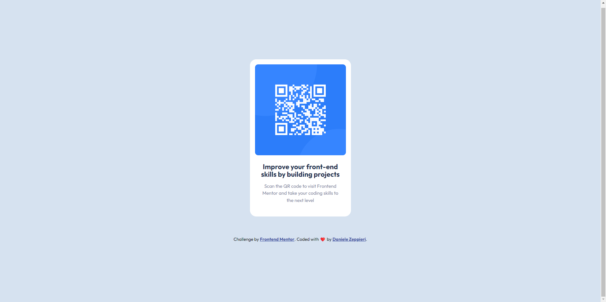

# Frontend Mentor - QR code component solution

This is a solution to the [QR code component challenge on Frontend Mentor](https://www.frontendmentor.io/challenges/qr-code-component-iux_sIO_H). Frontend Mentor challenges help you improve your coding skills by building realistic projects.

## Table of contents

- [Overview](#overview)
  - [Screenshot](#screenshot)
  - [Links](#links)
- [My process](#my-process)
  - [Built with](#built-with)
  - [What I learned](#what-i-learned)
  - [Continued development](#continued-development)
- [Author](#author)

## Overview

### Screenshot



### Links

- Solution URL: [Add solution URL here](https://your-solution-url.com)
- Live Site URL: [Add live site URL here](https://your-live-site-url.com)

## My process

### Built with

- Semantic HTML5 markup
- CSS custom properties
- Flexbox
- Mobile-first workflow
- Logical properties

### What I learned

With this challenge I refresh my knowledge with:

- CSS Custom Properties how to use and naming them;
- Flexbox;
- how to use <picture> element;
- how to use @import to import the font from Google Fonts;
- work with modern CSS Logical Properties and Relative Units;
- Fluid Typography.

```css
  .card {
      display: flex;
      flex-direction: column;
      max-width: 20rem;
      margin-inline: auto;
      background: var(--clr-cardBG);
      padding: 1em;
      border-radius: 20px;
      text-align: center;
  }
```

### Continued development

For the future projects I want to continue focusing on CSS Grid, Container Queries, JavaScript and HTML/CSS in general to become more confident with my knowledge

## Author

- Frontend Mentor - [@dedo-dev](https://www.frontendmentor.io/profile/dedo-dev)
- Linkedin - [@daniele-zeppieri](www.linkedin.com/in/daniele-zeppieri-0b1a36252)
- GitHub - [@dedo-dev](https://github.com/dedo-dev)